# 🚀 HireSmart

> **AI-Powered Resume Analysis, ATS Scoring, RAG-Based Resume Intelligence & LLM-Driven Mock Interview Platform**

HireSmart is a full-stack AI-powered career preparation platform that helps job seekers optimize their resumes, evaluate ATS compatibility, and prepare for interviews through personalized AI-driven mock interview sessions.

The platform combines **Natural Language Processing (NLP)**, **Retrieval-Augmented Generation (RAG)**, and **Large Language Models (LLMs)** to analyze resumes, generate ATS reports, create role-specific interview questions, and provide intelligent performance feedback. It delivers a complete end-to-end interview preparation experience through an intuitive and modern web application.

Built with **React**, **FastAPI**, **MongoDB Atlas**, **Cloudinary**, **SpaCy**, **RapidFuzz**, and **Groq**, HireSmart follows a scalable full-stack architecture designed for real-world deployment.

<p align="center">

AI-powered Resume Analysis • ATS Scoring • Resume-Aware RAG • Mock Interviews • AI Feedback

</p>

<p align="center">

Built with React • FastAPI • MongoDB Atlas • SpaCy • RapidFuzz • Groq

</p>

## 🔗 Live Links

🌐 **Frontend (Vercel)**  
https://hiresmart-amber.vercel.app

⚡ **Backend API (Render)**  
https://hiresmart-backend-49j2.onrender.com

📖 **Swagger API Documentation**  
https://hiresmart-backend-49j2.onrender.com/docs

## 🛠️ Tech Stack

### Frontend


### Backend


### Artificial Intelligence


### Cloud & Deployment


# ✨ Features

### 🔐 Authentication & Security

- Secure JWT-based user authentication
- Email/password sign-in plus Google sign-in via Google Identity Services
- Password hashing using Passlib & Bcrypt
- Protected API routes with authentication middleware
- Persistent login sessions
- Secure environment variable management

---

### 📄 AI Resume Analysis

- Upload resumes in **PDF/DOC/DOCX** format
- Secure resume storage using **Cloudinary**
- Automatic resume text extraction with **PyMuPDF**
- LLM-based resume parsing into structured JSON
- SpaCy-assisted skill tokenization and RapidFuzz skill matching
- Contact information extraction
- Education, Experience, Projects & Certifications detection
- Technical skill extraction and categorization
- Resume metadata stored in MongoDB Atlas

---

### 📊 ATS Resume Scoring

- Overall ATS compatibility score
- Section-wise ATS evaluation
- Resume completeness analysis
- Keyword matching against industry-standard skills
- Missing section detection
- Actionable improvement suggestions
- Resume grading (A–F)
- ATS-friendly formatting evaluation

---

### 🤖 AI Mock Interview

- Role-specific interview generation
- Job Description based interview customization
- AI-generated technical & behavioral questions
- Text-based interview responses
- AI-powered answer evaluation
- Personalized interview feedback
- Overall interview performance scoring

---

### 🧠 Retrieval-Augmented Generation (RAG)

- Resume-aware interview question generation
- Retrieves relevant resume context before prompting the LLM
- Produces personalized interview questions based on candidate experience
- Reduces hallucinations by grounding responses in resume data

---

### 📈 Dashboard & Analytics

- Resume upload status
- ATS score tracking
- Interview history
- Feedback reports
- Activity timeline
- Performance overview

---

### ☁️ Cloud Integration

- Resume storage using Cloudinary
- MongoDB Atlas database
- RESTful FastAPI backend
- Modern React frontend
- Production-ready deployment

# 📸 Project Screenshots

Explore HireSmart's user journey through the application's core features.

---

## 🏠 Landing Page

Modern AI-powered landing page introducing HireSmart and its intelligent career preparation features.

<p align="center">
  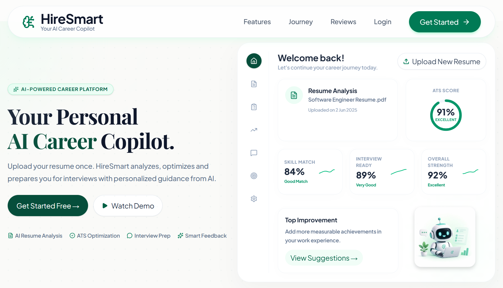
</p>

---

## ✨ Features Overview

Overview of HireSmart's key capabilities including ATS Analysis, Resume Intelligence, and AI Mock Interviews.

<p align="center">
  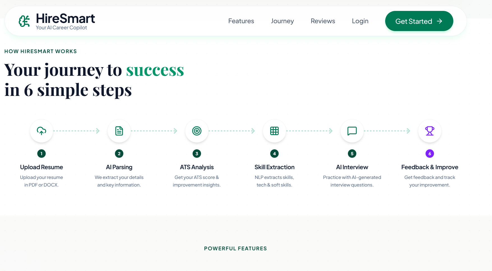
</p>

---

## 🤖 AI Features

Interactive section showcasing AI-powered resume analysis and interview preparation.

<p align="center">
  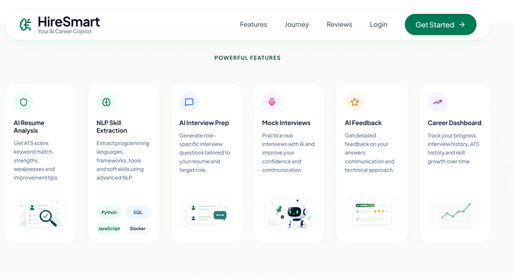
</p>

---

## 📌 Footer

Responsive footer with navigation, resources, and contact information.

<p align="center">
  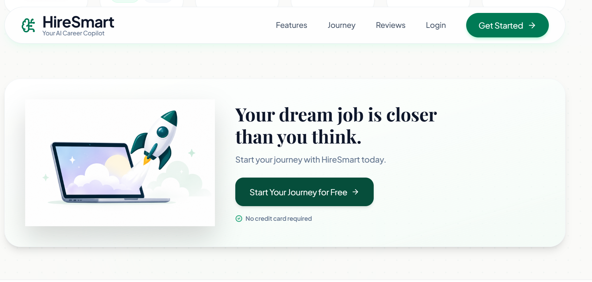
</p>

---

## 🔐 User Authentication

Secure JWT-based authentication with dedicated Login and Registration pages.

<p align="center">
  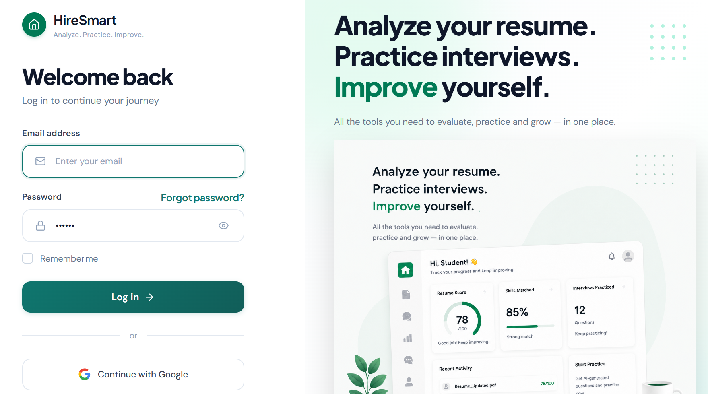
  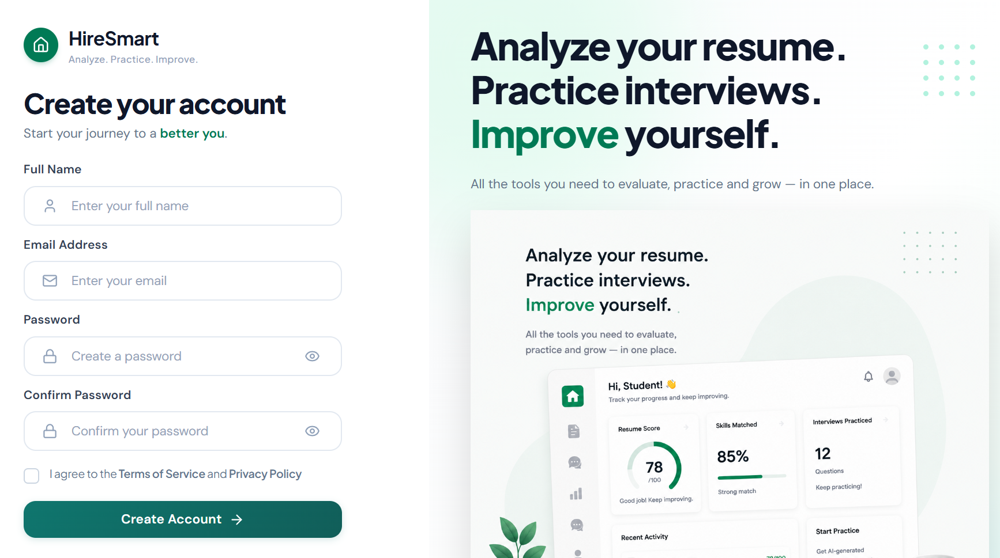
</p>

---

## 📊 Dashboard

Personalized dashboard displaying user activity, resume status, ATS score, interview statistics, and recent progress.

<p align="center">
  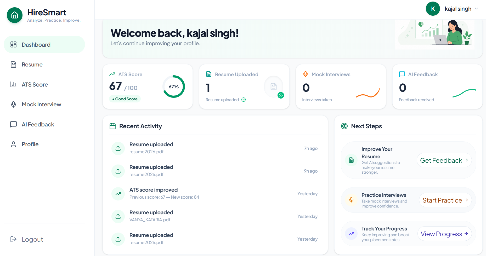
</p>

---

## 📄 Resume Upload

Upload resumes securely using Cloudinary with automatic parsing and NLP-based information extraction.

<p align="center">
  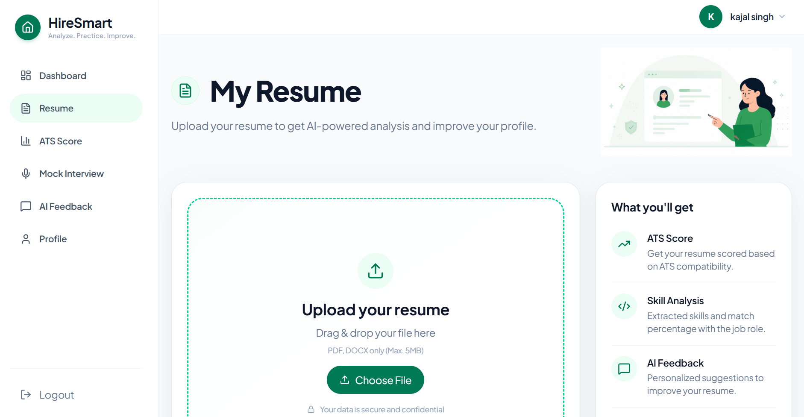
  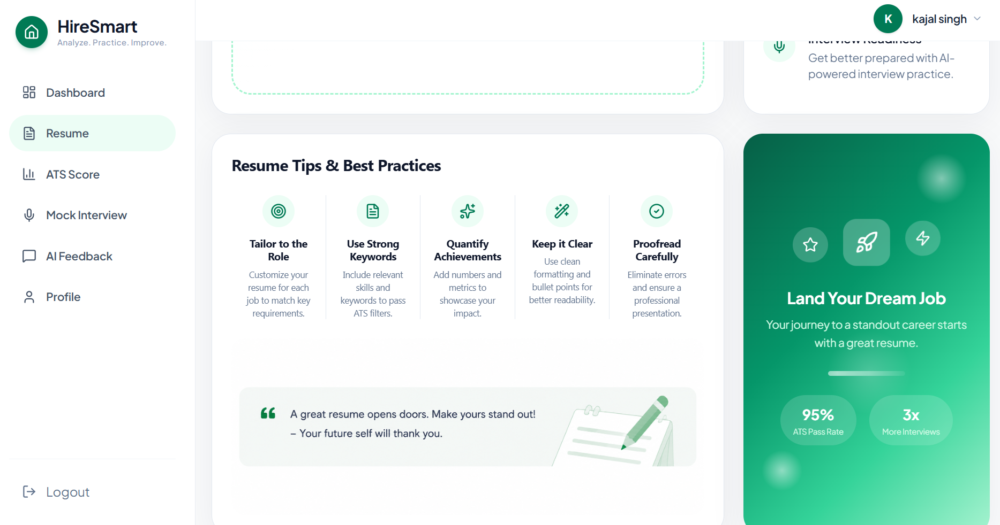
</p>

---

## 📈 ATS Resume Analysis

Comprehensive ATS evaluation including overall score, category-wise breakdown, formatting analysis, keyword matching, and actionable improvement suggestions.

<p align="center">
  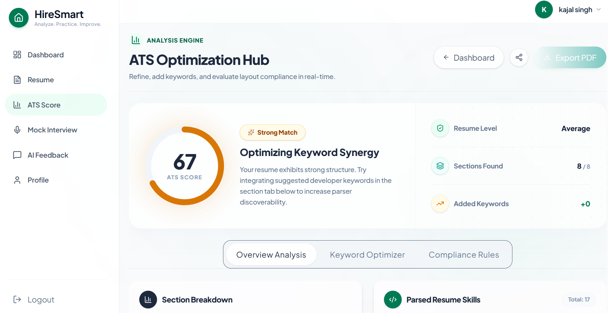
  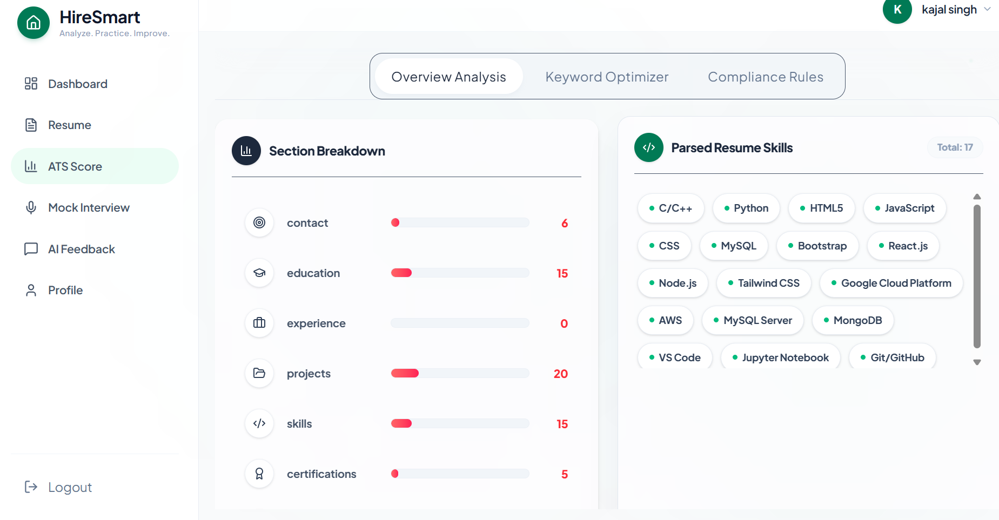
</p>

<p align="center">
  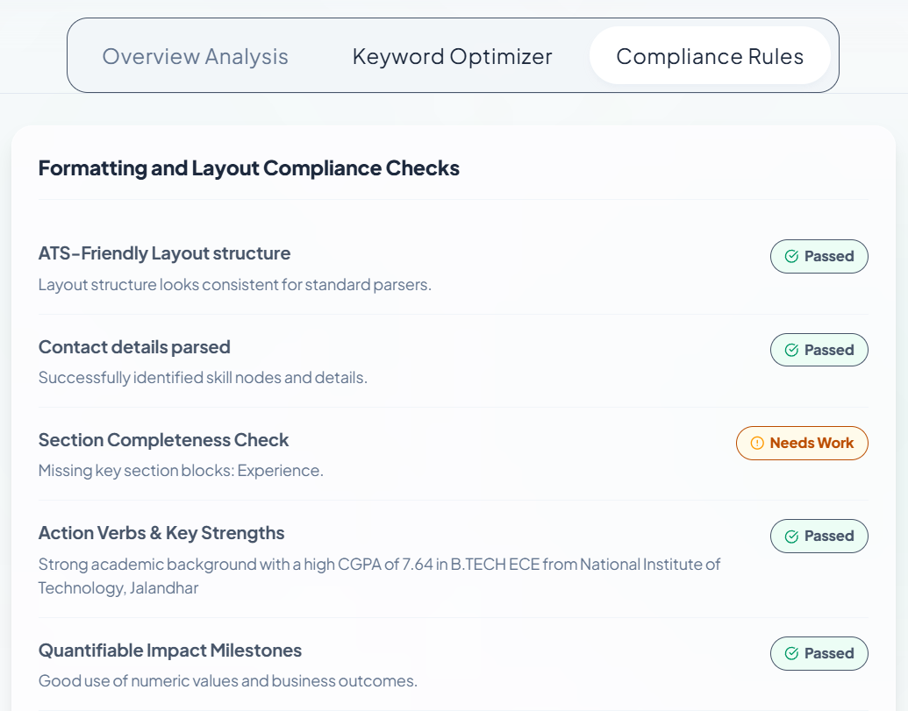
  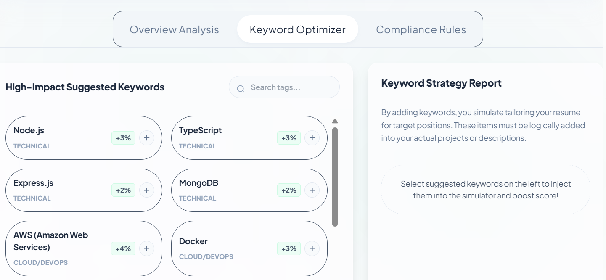
</p>

---

## 🎤 AI Mock Interview

Role-specific mock interview generated using Large Language Models and Resume-Aware Retrieval-Augmented Generation (RAG).

<p align="center">
  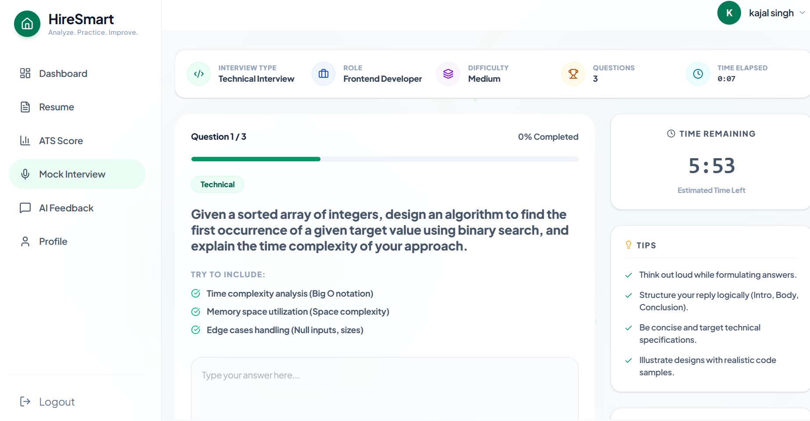
</p>

# 🏗️ System Architecture

HireSmart follows a modular client-server architecture that combines NLP, Retrieval-Augmented Generation (RAG), and Large Language Models to deliver personalized resume analysis and AI-powered interview preparation.

```text
                                ┌──────────────────────┐
                                │      React + Vite    │
                                │      Frontend UI     │
                                └──────────┬───────────┘
                                           │
                                           │ REST API
                                           ▼
                             ┌─────────────────────────┐
                             │     FastAPI Backend     │
                             └──────────┬──────────────┘
                                        │
          ┌─────────────────────────────┼─────────────────────────────┐
          │                             │                             │
          ▼                             ▼                             ▼
 ┌────────────────┐          ┌──────────────────┐          ┌─────────────────┐
 │ Authentication │          │ Resume Pipeline  │          │ Mock Interview  │
 │ JWT + Bcrypt   │          │ ATS + NLP        │          │ AI Evaluation   │
 └────────────────┘          └──────────────────┘          └─────────────────┘
                                         │
                                         ▼
                           ┌─────────────────────────┐
                           │     Resume Parsing      │
                           │ PyMuPDF + SpaCy +       │
                           │ RapidFuzz               │
                           └──────────┬──────────────┘
                                      │
                                      ▼
                         ┌──────────────────────────┐
                         │     ATS Engine           │
                         │ Resume Scoring           │
                         │ Keyword Analysis         │
                         │ Suggestions              │
                         └──────────┬───────────────┘
                                    │
                                    ▼
                        ┌───────────────────────────┐
                        │        RAG Layer          │
                        │ Resume Context Retrieval  │
                        │ Relevant Experience       │
                        └──────────┬────────────────┘
                                   │
                                   ▼
                      ┌──────────────────────────────┐
                      │       Groq Large Language    │
                      │       Model                  │
                      └──────────┬───────────────────┘
                                 │
                                 ▼
                    Personalized Questions & Feedback
                                 │
                                 ▼
                     MongoDB Atlas + Cloudinary
```

---

## Architecture Highlights

- **React + Vite** powers a responsive and modern user interface.
- **FastAPI** exposes asynchronous REST APIs for authentication, resume analysis, and interview workflows.
- **MongoDB Atlas** stores user profiles, parsed resumes, ATS reports, interview history, and feedback.
- **Cloudinary** securely stores uploaded resumes while MongoDB stores their metadata.
- **PyMuPDF** extracts resume text; the Groq LLM transforms it into structured JSON.
- **SpaCy** assists skill tokenization and **RapidFuzz** normalizes matched skills against the built-in skill database.
- A custom **ATS Engine** evaluates resume quality and generates actionable improvement suggestions.
- A **Retrieval-Augmented Generation (RAG)** layer retrieves relevant resume context before prompting the LLM.
- **Groq** generates personalized interview questions, ATS feedback, and candidate-response evaluations.

# ⚙️ End-to-End Workflow

HireSmart processes every resume through a multi-stage AI pipeline that combines document parsing, Natural Language Processing (NLP), Retrieval-Augmented Generation (RAG), and Large Language Models (LLMs) to deliver personalized career assistance.

---

## Step 1 — Resume Upload

- The candidate uploads a resume in **PDF**, **DOC**, or **DOCX** format.
- The file is securely uploaded to **Cloudinary**.
- Resume metadata is stored in **MongoDB Atlas**.
- A temporary local copy is removed after successful upload.

---

## Step 2 — Resume Text Extraction

- **PyMuPDF** extracts raw text from the uploaded document.
- Resume content is cleaned and normalized for downstream processing.
- Headers, formatting artifacts, and unnecessary whitespace are removed.

---

## Step 3 — NLP-Based Resume Parsing

HireSmart sends the extracted resume text to the Groq LLM, which returns a structured JSON representation.

The parser extracts:

- Personal Information
- Technical Skills
- Soft Skills
- Education
- Work Experience
- Projects
- Certifications
- Contact Details

SpaCy tokenization and RapidFuzz fuzzy matching are available in the skill-processing utilities to normalize skill candidates against predefined technical-skill databases.

---

## Step 4 — ATS Resume Evaluation

The custom ATS Engine evaluates the parsed resume using multiple scoring criteria.

Evaluation includes:

- Resume Structure
- Section Completeness
- Keyword Coverage
- Formatting Quality
- Skill Relevance
- Missing Sections
- ATS Compatibility

The engine generates:

- Overall ATS Score
- Category-wise Scores
- Improvement Suggestions
- Resume Strengths
- Resume Weaknesses

---

## Step 5 — Resume-Aware RAG

Instead of generating interview questions solely from the prompt, HireSmart first retrieves the most relevant information from the candidate's resume.

The retrieved context may include:

- Previous projects
- Technical skills
- Work experience
- Certifications
- Education
- Technologies used

This context is injected into the prompt before sending it to the LLM, resulting in more personalized and context-aware interview questions.

---

## Step 6 — AI Mock Interview

The candidate selects:

- Target Role
- Difficulty Level
- Interview Topic

HireSmart generates personalized interview questions using **Groq** based on:

- Resume context (RAG)
- Selected job role
- Candidate experience
- Difficulty level

---

## Step 7 — AI Evaluation

Candidate responses are evaluated across multiple dimensions.

The AI assesses:

- Technical Accuracy
- Problem Solving
- Communication Skills
- Confidence
- Completeness
- Professionalism

The system generates:

- Overall Performance Score
- Detailed Feedback
- Strength Analysis
- Weakness Analysis
- Personalized Improvement Suggestions

---

## Step 8 — Dashboard Update

After each interview session, HireSmart updates the user's dashboard with:

- Latest ATS Score
- Resume Status
- Interview History
- Performance Metrics
- Recent Activities
- AI Feedback Reports

All user progress is stored in MongoDB Atlas for future sessions.

# 🧠 AI Components

HireSmart combines Natural Language Processing (NLP), a custom ATS Engine, Retrieval-Augmented Generation (RAG), and Large Language Models (LLMs) to deliver intelligent resume analysis and personalized interview preparation.

---

## 📄 Resume Parsing

The first stage of the AI pipeline focuses on converting an unstructured resume into structured information.

### Technologies

- PyMuPDF
- SpaCy NLP
- RapidFuzz

### Responsibilities

- Extract raw text from PDF resumes
- Detect resume sections automatically
- Identify personal information
- Extract technical and soft skills
- Parse education and work experience
- Detect projects and certifications
- Normalize extracted information into structured JSON

This structured representation becomes the foundation for every downstream AI task.

---

## 📊 ATS Scoring Engine

HireSmart includes a custom-built ATS Engine designed to simulate how Applicant Tracking Systems evaluate resumes.

The engine analyzes multiple aspects of a resume, including:

- Resume structure
- Section completeness
- Formatting quality
- Keyword coverage
- Skill relevance
- ATS compatibility
- Missing information

The engine produces:

- Overall ATS Score
- Category-wise Scores
- Resume Strengths
- Improvement Suggestions
- Missing Keywords
- Resume Quality Assessment

Unlike a simple keyword matcher, the scoring engine combines structural analysis with NLP-based information extraction to provide more meaningful feedback.

---

## 🧠 Natural Language Processing (NLP)

The Groq LLM performs the primary resume-to-JSON transformation. SpaCy and RapidFuzz are supporting utilities for skill tokenization and fuzzy skill normalization; they are not the primary resume parser.

NLP is used to:

- Tokenize resume text
- Recognize entities
- Detect section boundaries
- Extract contact details
- Normalize skills
- Improve parsing accuracy

RapidFuzz complements NLP by performing fuzzy matching against predefined technical skill databases, allowing HireSmart to recognize different spellings and variations of the same skill.

---

## 🔍 Retrieval-Augmented Generation (RAG)

Instead of asking the LLM to generate interview questions from scratch, HireSmart first retrieves relevant information from the candidate's resume.

The retrieval stage identifies:

- Relevant projects
- Technologies used
- Work experience
- Education
- Certifications
- Technical skills

Only the most relevant context is passed to the language model.

This approach helps:

- Generate personalized interview questions
- Reduce hallucinations
- Improve response relevance
- Ground AI responses in real candidate data

---

## 🤖 Large Language Models (LLMs)

HireSmart integrates modern LLMs to power intelligent interview generation and evaluation.

Current integrations include:

- Groq API

The LLM is responsible for:

- Generating interview questions
- Creating follow-up questions
- Evaluating candidate responses
- Identifying strengths and weaknesses
- Producing detailed interview feedback
- Recommending areas for improvement

---

## ☁️ Cloud Infrastructure

The application uses cloud services for scalability and reliability.

### MongoDB Atlas

Stores:

- User accounts
- Parsed resumes
- ATS reports
- Interview history
- Feedback reports
- Dashboard statistics

### Cloudinary

Handles:

- Resume storage
- Secure file delivery
- Cloud-hosted document management

---

## 🔄 AI Processing Pipeline

```text
Resume Upload
      │
      ▼
Cloudinary Storage
      │
      ▼
PyMuPDF Text Extraction
      │
      ▼
Groq LLM Resume Parsing
      │
      ▼
RapidFuzz Skill Matching
      │
      ▼
ATS Scoring Engine
      │
      ▼
Resume Context Retrieval (RAG)
      │
      ▼
Groq LLM
      │
      ▼
Interview Generation
      │
      ▼
AI Evaluation
      │
      ▼
Feedback & Dashboard
```

The modular design allows each AI component to evolve independently, making it easier to improve parsing accuracy, ATS scoring, or interview generation without affecting the rest of the application.

# 🚀 Getting Started

Follow the steps below to run HireSmart locally.

## 1️⃣ Clone the Repository

```bash
git clone https://github.com/devkajals41/HireSmart.git
cd HireSmart
```

---

## 2️⃣ Backend Setup

Navigate to the backend directory.

```bash
cd backend
```

Create a virtual environment.

```bash
python -m venv venv
```

Activate the virtual environment.

### Windows

```bash
venv\Scripts\activate
```

### macOS / Linux

```bash
source venv/bin/activate
```

Install dependencies.

```bash
pip install -r requirements.txt
```

Create a `.env` file inside the backend directory.

```env
MONGODB_URI=
DATABASE_NAME=

JWT_SECRET=
JWT_ALGORITHM=HS256
ACCESS_TOKEN_EXPIRE_MINUTES=1440

GROQ_API_KEY=

CLOUDINARY_CLOUD_NAME=
CLOUDINARY_API_KEY=
CLOUDINARY_API_SECRET=
```

Start the FastAPI server.

```bash
uvicorn main:app --reload
```

Backend runs on

```
http://localhost:8000
```

---

## 3️⃣ Frontend Setup

Open another terminal.

```bash
cd frontend
```

Install dependencies.

```bash
npm install
```

Create a `.env` file.

```env
VITE_API_URL=http://localhost:8000/api
```

Start the development server.

```bash
npm run dev
```

Frontend runs on

```
http://localhost:5173
```

---

## 4️⃣ Build for Production

### Frontend

```bash
npm run build
```

### Backend

```bash
uvicorn main:app --host 0.0.0.0 --port 8000
```

---

## 5️⃣ Production Deployment

### Frontend

- Vercel

### Backend

- Render

### Database

- MongoDB Atlas

### Resume Storage

- Cloudinary

# 📁 Project Structure

```text
HireSmart/
│
├── backend/
│   ├── app/
│   │   ├── config/           # Environment configuration
│   │   ├── database/         # MongoDB connection
│   │   ├── dependencies/     # Authentication dependencies
│   │   ├── models/           # Pydantic schemas
│   │   ├── repositories/     # Database operations
│   │   ├── routes/           # REST API endpoints
│   │   ├── services/         # Business logic & cloud services
│   │   └── utils/            # ATS Engine, NLP, Resume Parser & RAG
│   │
│   ├── uploads/              # Temporary local uploads
│   ├── requirements.txt
│   ├── requirements-dev.txt
│   └── main.py
│
├── frontend/
│   ├── public/
│   ├── src/
│   │   ├── assets/
│   │   ├── components/
│   │   ├── pages/
│   │   ├── services/
│   │   ├── store/
│   │   ├── utils/
│   │   ├── App.jsx
│   │   └── main.jsx
│   │
│   ├── package.json
│   └── vite.config.js
│
├── screenshots/
├── README.md
└── LICENSE
```

---

## Backend Overview

| Module           | Responsibility                                               |
| ---------------- | ------------------------------------------------------------ |
| **Routes**       | Defines REST API endpoints                                   |
| **Services**     | Implements business logic and AI workflows                   |
| **Repositories** | Handles MongoDB database operations                          |
| **Models**       | Pydantic request and response schemas                        |
| **Utils**        | ATS Engine, Resume Parser, NLP pipeline, Skill Matching, RAG |
| **Config**       | Loads environment variables and application settings         |
| **Database**     | MongoDB Atlas connection and initialization                  |

---

## Frontend Overview

| Module         | Responsibility                                                    |
| -------------- | ----------------------------------------------------------------- |
| **Pages**      | Application screens (Dashboard, ATS, Resume, Interview, Feedback) |
| **Components** | Reusable UI components                                            |
| **Services**   | API communication using Axios                                     |
| **Store**      | Global state management with Redux Toolkit                        |
| **Assets**     | Images, icons, and static resources                               |
| **Utils**      | Helper and utility functions                                      |

---

The project follows a **modular architecture**, separating presentation, business logic, database access, AI processing, and cloud integrations into dedicated modules. This structure improves maintainability, scalability, and makes future feature development easier.

# 🌐 REST API

HireSmart exposes a RESTful API built with **FastAPI**. All endpoints return JSON responses and use JWT-based authentication where required.

**Base URL**

```text
http://localhost:8000/api
```

Production

```text
https://hiresmart-backend-49j2.onrender.com/api
```

---

## 🔐 Authentication

| Method | Endpoint         | Description                        | Authentication |
| ------ | ---------------- | ---------------------------------- | -------------- |
| POST   | `/auth/register` | Register a new user                | ❌             |
| POST   | `/auth/login`    | Authenticate user and generate JWT | ❌             |

---

## 📄 Resume Management

| Method | Endpoint         | Description                           | Authentication |
| ------ | ---------------- | ------------------------------------- | -------------- |
| POST   | `/resume/upload` | Upload and analyze a resume           | ✅             |
| GET    | `/resume/view`   | View uploaded resume                  | ✅             |
| GET    | `/resume/report` | Retrieve parsed resume and ATS report | ✅             |

---

## 🎤 AI Mock Interview

| Method | Endpoint              | Description                                           | Authentication |
| ------ | --------------------- | ----------------------------------------------------- | -------------- |
| POST   | `/interview/generate` | Generate AI interview questions                       | ✅             |
| POST   | `/interview/evaluate` | Evaluate candidate responses and generate AI feedback | ✅             |

---

## 📊 Dashboard

| Method | Endpoint     | Description                                       | Authentication |
| ------ | ------------ | ------------------------------------------------- | -------------- |
| GET    | `/dashboard` | Retrieve dashboard statistics and recent activity | ✅             |

---

## 🔒 Authentication Flow

Protected endpoints require a valid JWT

# 🔐 Environment Variables

HireSmart uses environment variables to securely manage API keys, database credentials, and application configuration.

## Backend (`backend/.env`)

Create a `.env` file inside the `backend` directory with the following variables:

```env
# MongoDB
MONGODB_URI=
DATABASE_NAME=

# JWT Authentication
JWT_SECRET=
JWT_ALGORITHM=HS256
ACCESS_TOKEN_EXPIRE_MINUTES=1440
GOOGLE_CLIENT_ID=

# AI APIs
GROQ_API_KEY=

# Cloudinary
CLOUDINARY_CLOUD_NAME=
CLOUDINARY_API_KEY=
CLOUDINARY_API_SECRET=
```

## Frontend (`frontend/.env`)

Create a `.env` file inside the `frontend` directory with the following variables:

```env
VITE_API_URL=http://localhost:8000/api
VITE_GOOGLE_CLIENT_ID=
```

---

## Frontend (`frontend/.env`)

Create a `.env` file inside the `frontend` directory.

```env
VITE_API_URL=http://localhost:8000/api
```

For production deployment:

```env
VITE_API_URL=https://hiresmart-backend-49j2.onrender.com/api
```

---

## Security Notice

- Never commit `.env` files to version control.
- Store all secrets securely using your hosting provider's environment variable manager.
- The repository includes `.env.example` files as templates for local development.

# 🚀 Roadmap

HireSmart is actively evolving. While Version 1 delivers a complete AI-powered interview preparation platform, several advanced features are planned for future releases.

## ✅ Version 1 (Current)

- JWT Authentication
- Resume Upload & Cloud Storage
- Resume Parsing using NLP
- ATS Resume Analysis
- Resume-Aware RAG Pipeline
- AI Mock Interview Generation
- AI Interview Evaluation
- Personalized Feedback Reports
- Dashboard & Activity Tracking
- Cloud Deployment (Vercel + Render)

---

## 🔄 Version 2 (In Progress)

### 📄 Advanced Resume Parsing

- Improve section detection accuracy
- Better project and experience extraction
- Enhanced contact information recognition
- Improved education parsing
- Smarter certification detection

---

### 🧠 Next-Generation ATS Engine

- Semantic keyword matching using embeddings
- Resume-job description similarity scoring
- Industry-specific ATS evaluation
- Better formatting and readability analysis
- AI-generated resume improvement suggestions
- Context-aware scoring instead of rule-based evaluation

---

### 🔍 Enhanced Retrieval-Augmented Generation (RAG)

- Vector database integration
- Resume chunk embeddings
- Semantic retrieval
- Context-aware interview generation
- Company-specific knowledge retrieval
- Technical document retrieval support

---

### 🎤 AI Interview Improvements

- Voice-based interviews
- Speech-to-text integration
- Follow-up questioning
- Adaptive interview difficulty
- Real-time AI interviewer

---

### 📊 Analytics

- Resume score history
- Interview performance trends
- Skill growth tracking
- Progress analytics
- Personalized learning insights

---

### 💼 Career Intelligence

- Resume optimization assistant
- AI-generated cover letters
- Job recommendation engine
- Company interview preparation
- Resume version comparison

---

## 🌟 Long-Term Vision

The long-term goal of HireSmart is to become an AI-powered career preparation platform that assists candidates throughout the entire hiring journey—from resume creation and ATS optimization to personalized interview coaching, performance analytics, and job readiness.

# 🤝 Contributing

Contributions, issues, and feature requests are welcome.

If you'd like to contribute:

1. Fork the repository.
2. Create a new feature branch.
3. Commit your changes with clear commit messages.
4. Push the branch to your fork.
5. Open a Pull Request.

For major changes, please open an issue first to discuss the proposed modifications.

---

# 📜 License

This project is licensed under the **MIT License**.

You are free to use, modify, and distribute this project in accordance with the license terms.

See the **LICENSE** file for more information.

---

# 👩‍💻 Author

### Kajal Singh

**Electronics & Communication Engineering Undergraduate**  
**Dr. B.R. Ambedkar National Institute of Technology (NIT) Jalandhar**

Passionate about building AI-powered full-stack applications that combine modern web technologies with Natural Language Processing, Retrieval-Augmented Generation (RAG), and Large Language Models to solve real-world problems.

## ⭐ Support

If you found this project helpful, consider giving it a ⭐ on GitHub.

Your support helps improve the project and motivates future development.

---

<p align="center">

Made with ❤️ using React, FastAPI, MongoDB, NLP, RAG & AI

</p>
